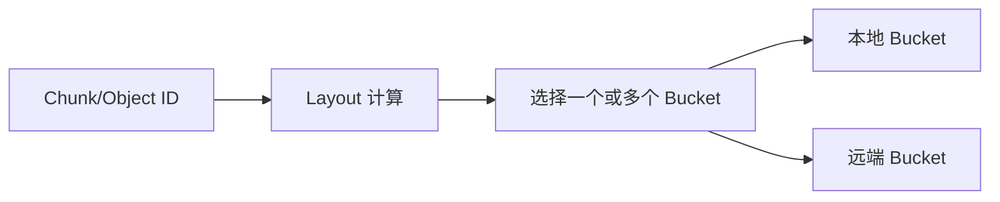
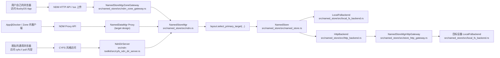

# NDM Protocol Overview

CYFS-NDN 仓库里和 Named Data 相关的协议，整体上可以按职责拆成三层。  
这三层不是“按代码模块分目录”得到的结果，而是按**问题域**拆出来的：

- 跨 Zone 怎么分发和访问 Named Data
- Zone 内一个进程怎么访问 Named Store Manager
- 当数据已经确定落到某个Device的 store bucket 后，怎么执行最薄的一层对象/Chunk 读写

这份文档的目标是解释**为什么要这样分层**、**每层分别解决什么问题**，并给出当前仓库文档和这三层的对应关系。  
具体 API、报文和状态机仍以各自的协议文档为准。

## 1. 分层背后的核心问题

Named Data Store（NDM）面向的是分布式存储场景。系统里同时存在两类完全不同的问题：

1. 数据应该落到哪个 bucket，如何完成对象/Chunk 的实际存取
2. 数据跨设备、跨 Zone 时，应该怎样暴露接口、做鉴权、做分发

如果把这两类问题混在一起，协议会同时承担：

- bucket 级别的高性能读写
- Zone 内部调用
- 公网分发
- 鉴权和业务语义

这样会导致边界混乱，也会让底层存储协议背上不必要的复杂度。

因此，整个体系需要把“**存储实现**”、“**Zone 内访问**”和“**跨 Zone 分发**”拆开。

## 2. 总体分层

### 2.1 第一层：CYFS Protocol

**http://$zoneid/ndn/**

这是公网层、跨 Zone 层协议，核心语义是：

> 从一个 Zone Pull 一个 Named Data,并有足够的可验证信息

这一层面向的是：

- 跨 Zone 的内容访问
- 基于对象引用的分发
- Pull-first 的传播模型
- 更强的验证与授权检查

它不是底层 bucket 读写协议，也不是 Zone 内部进程访问 store manager 的控制面协议。

相关文档：

- [../CYFS Protocol/CYFS Protocol.md](../CYFS%20Protocol/CYFS%20Protocol.md)

### 2.2 第二层：NDM HTTP Protocol

第二层统一解决的问题仍然是：

> 设备上的一个进程，应该用什么协议访问 Zone 内的 Named Data Manager

但按调用方和语义不同，这一层现在明确拆成两套协议：

- `NamedDataMgr Zone Protocol`
  面向浏览器 / WebUI / Zone Gateway 上传入口
- `NamedDataMgr Proxy Protocol`
  面向 Zone 内受信进程的 `ndm_client` 远程代理入口

两者都属于 Zone 内访问层，但职责不同：

- 都服务于 Zone 内调用面
- 都不直接等同于 bucket 级最薄协议
- 都可以在服务端内部继续调用 `NamedStoreMgr`
- 但 browser/gateway 协议更关注上传编排
- proxy 协议更关注 `NamedDataMgr` 能力的远程等价性

#### 2.2.1 NamedDataMgr Zone Protocol

给浏览器使用，通常是 App WebUI 里的上传入口，兼容 tus 的 chunk 上传语义，通常需要授权：

**http://$zoneid/ndm/v1/objects**  
**http://$zoneid/ndm/v1/store**  
**http://$zoneid/ndm/v1/uploads**

它关注的是：

- 浏览器友好的上传入口
- 查重、上传会话、缓存、配额、TTL
- 结构化 JSON 控制面
- 面向上传场景的 chunk 会话协议

相关文档：

- [named-data-mgr-zone-protocol.md](./named-data-mgr-zone-protocol.md)

#### 2.2.2 NamedDataMgr Proxy Protocol

给 Zone 内 App / service / agent 使用的 `NamedDataMgr` 访问代理：

**http://127.0.0.1:3180/ndm/**  
或其他等价的 loopback / NodeGateway 受控入口

它关注的是：

- Zone 内受信进程如何远程调用 `NamedDataMgr`
- 控制面 JSON RPC
- reader / writer 的流式 data-plane 接口
- 尽量贴近 `src/named_store/src/ndm.rs` 的远程代理能力

相关文档：

- [named-data-mgr-proxy-protocol.md](./named-data-mgr-proxy-protocol.md)

补充说明：

- 给 Zone 内使用的 `http://$zoneid/cyfs/` 仍然是占位入口，不属于这两份 NDM 协议文档的主体

### 2.3 第三层：Named Store HTTP Protocol

**http://$device_ip:port/$chunkid**
**http://$device_ip:port/_gc/**

这是实现层协议，解决的核心问题是：

> 当一个 device 上有 Named Store bucket 时，应该怎样通过协议访问这个 bucket

典型调用链是：

`Device -> NodeGateway -> NamedStoreBucket`

这一层协议尽量简洁纯粹，只关心：

- `put/get object`
- `get chunk state`
- `open chunk reader`
- `open chunk writer`

它是 bucket/data-plane 级别的能力，不承担上层复杂业务语义。

相关文档：

- [named-store-http-protocol.md](./named-store-http-protocol.md)

## 3. 为什么需要三层而不是一层

### 3.1 bucket 与 layout 要分开

在 NDM 中，每个 store 可以抽象成一个 bucket。  
bucket 是最底层、最稳定的存储单元，只关心：

- 如何保存对象或 Chunk
- 如何暴露最基本的读写能力
- 如何在本地目录、磁盘或远端等价存储上管理自身数据

真正决定“一个 chunk 应该落到哪个 bucket、落几个副本”的，是 layout。  
给定 `chunk_id` 和 layout，系统应该能确定性地计算：

- 该 chunk 对应哪些 bucket
- 需要写入几个副本
- 数据分布是否满足可靠性和可用性目标

也就是说：

- layout 负责“算去哪里”
- gateway / 协议负责“怎么到那里”
- bucket 协议负责“到了以后怎么读写”

### 3.2 Zone 内与跨 Zone 的哲学不同

底层 store 层和跨 Zone 分发层，语义哲学并不相同。

Zone 内 / store 层通常更偏向：

- 极薄协议
- 强调性能
- bucket 与 chunk 级语义
- push-first

跨 Zone / CYFS 层则更偏向：

- 基于对象引用
- 强验证、强鉴权
- pull-first
- 与消息、分享、传播等上层业务策略联动

这两类协议不能混为一谈。

### 3.3 Reader 可以薄，Writer 也要尽量薄

在底层 Named Store 协议里，Chunk Reader 支持 Range 很自然，因为读取是按偏移访问已有数据。  
但 Writer 不应该下沉出一套复杂的断点续传状态机。

当前设计倾向于：

- chunk 的标准大小维持在可接受范围内
- 写入端使用幂等写策略
- 已完成就复用
- 未完成就从头重传

这样能把底层 bucket 协议保持在最小语义集合内。  
更复杂的上传编排，应放到 NDM HTTP Protocol 这一层去做，例如 tus 风格会话上传。

## 4. Gateway 在体系中的位置

当 bucket 位于远端设备时，系统需要一个 gateway 来桥接访问。  
因此从访问模型上看：

- 本地 bucket：直接打开并读写
- 远端 bucket：先由 layout 选中，再通过 gateway 转成远程读写

在 Zone 内，gateway / proxy 负责把设备侧请求映射到 `NamedDataMgr` 的上传面、控制面和流式读写面。  
在当前实现中，已经落地的入口主要是 `NamedStoreMgrZoneGateway -> NamedStoreMgr` 这条链；`NamedDataMgr Proxy` 仍是正在补齐的设计层。  
在更高层，Zone Gateway 还可能参与跨 Zone 的 pull 链路，但这已经属于 CYFS Protocol 关心的分发问题，而不是 bucket 协议本身。

## 5. 当前目录中的文档关系

`doc/NDM Protocol` 目录当前主要承载后两层文档：

- `overview.md`
  讲分层设计、职责边界、协议关系
- `named-data-mgr-zone-protocol.md`
  第二层中的 browser / gateway 协议，面向当前 Zone Gateway 实现的上传协议与结构化入口
- `named-data-mgr-proxy-protocol.md`
  第二层中的 proxy 协议，面向 Zone 内受信进程的 `NamedDataMgr` 远程代理设计
- `named-store-http-protocol.md`
  第三层，面向 bucket/data-plane 的最薄 HTTP 协议

第一层 `CYFS Protocol` 位于上一级目录：

- `doc/CYFS Protocol/CYFS Protocol.md`

## 6. 当前实现中的典型调用路径

除了分层设计本身，当前代码里已经有几条比较明确的落地链路。  
从实现上看，核心汇聚点是 `NamedStoreMgr`：无论入口是 Zone 内浏览器访问 BuckyOS App 的上传面、Zone 内进程使用 proxy 代理访问 NDM，还是 Zone 外浏览器访问按 `cyfs://` 协议提供 pull 访问的内容，最终的数据读写都会收敛到 `NamedStoreMgr` 选桶，再进入具体 backend。

需要特别说明的是，当前入口现在可以分成三类：

- Zone 内浏览器访问 BuckyOS App，自带上传语义，入口是 `NamedStoreMgrZoneGateway` 的 NDM HTTP / tus 接口
- Zone 内进程通过 `ndm_client` 访问 `NamedDataMgr Proxy Protocol`
- Zone 外浏览器访问按 `cyfs://` 协议提供 pull 访问的内容，入口是 `NdnDirServer`

其中：

- 第一类是当前已实现的第二层 browser/gateway 协议
- 第二类是第二层 proxy 协议的目标形态
- 第三类虽然语义上属于 CYFS 层，但在当前代码实现里，`NdnDirServer` 也是直接持有 `NamedStoreMgr`，没有先经过 `NamedDataMgr` 再下沉到 `store_mgr`

下面这张图描述的是当前体系里三条典型入口，以及它们如何汇聚到 store/data-plane：

可以把这张图理解成两层汇聚：

1. Zone 内 browser/gateway 入口、Zone 内 proxy 入口和 Zone 外发布访问入口都汇聚到 `NamedStoreMgr`
2. `NamedStoreMgr` 再根据 layout 和 store 配置，汇聚到本地 backend 或远端 `store_http` backend

### 6.1 Zone 内浏览器上传路径

当用户在自己的 laptop 上，通过浏览器访问一个 BuckyOS App 并上传文件时，当前实现里对应的入口是：

- `src/named_store/src/ndm_zone_gateway.rs`

这条链路本质上属于 Zone 内上传面，而不是对外发布面：

- 浏览器侧上传走 `NamedStoreMgrZoneGateway`
- 大文件 / chunk 上传走 tus 风格会话协议
- 结构化控制面请求也由同一个 gateway 承接
- gateway 最终调用 `NamedStoreMgr` 执行查重、选桶和写入

因此，这条链路更准确地说是：

`User Browser -> BuckyOS App -> NamedStoreMgrZoneGateway -> NamedStoreMgr -> NamedStore backend`

这里的“浏览器”是 Zone 内受信上传客户端，解决的是“如何把文件送进本 Zone 的 NDM”。

### 6.2 Zone 外浏览器访问 `cyfs://` pull 内容的路径

当用户的朋友通过通用浏览器访问某个 Zone，查看按 `cyfs://` 协议对外提供 pull 访问的内容时，当前实现对应的入口是：

- `src/ndn-toolkit/src/cyfs_ndn_dir_server.rs`

它的实现说明非常直接：

- `cyfs://` 风格 O-Link / R-Link 请求由 `NdnDirServer` 处理
- `NdnDirServer` 直接依赖 `NamedStoreMgr`
- 对象读取走 `store_mgr.get_object(...)`
- chunk / chunklist 读取走 `store_mgr.open_chunk_reader(...)` 或 `open_chunklist_reader(...)`
- 自动对象化扫描时，写入路径也直接调用 `store_mgr.put_object(...)` / `put_chunk_by_reader(...)`

因此，这条链路更准确地说是：

`Friend Browser -> CYFS request -> NdnDirServer -> NamedStoreMgr -> NamedStore backend`

这条链路体现的是“对外 `pull` 内容的浏览器访问入口直接复用 NDM store 能力”。

### 6.3 Zone 内 App / Docker 走 Proxy 的路径

Zone 内部进程如果走 `NamedDataMgr Proxy Protocol`，目标链路应是：

`App@Docker -> NDM Proxy API -> NamedDataMgr Proxy -> NamedStoreMgr`

这条链路和 browser/gateway 协议的关键差异在于：

- 它不以 tus 上传会话为核心
- 它不以浏览器兼容为目标
- 它要尽量贴近 `src/named_store/src/ndm.rs` 的远程代理能力
- 它会同时包含 JSON RPC 控制面和流式 read/write data-plane

也就是说，它解决的是“客户端如何远程调用 `NamedDataMgr`”，而不是“浏览器如何上传文件到 Zone”。

### 6.4 当前实现中的 Zone 内 App 路径

当前代码里，Zone 内 App 若走 HTTP 入口，实际已落地的仍主要是：

- `src/named_store/src/ndm_zone_gateway.rs`

也就是：

`App@Docker -> NDM HTTP API -> NamedStoreMgrZoneGateway -> NamedStoreMgr`

因此当前实现状态可以理解为：

- browser/gateway 协议已经有明确落地
- proxy 协议已经完成职责定义，但实现还需要继续补齐

### 6.5 `NamedStoreMgr` 之后的本地 / 远端分支

`NamedStoreMgr` 是当前实现中真正的“选桶 + 路由”核心：

- 它根据 layout 里的 `select_primary_target(...)` 选择目标 store
- 目标 store 是一个 `NamedStore`
- `NamedStore` 再持有具体的 `NamedDataStoreBackend`

当前实现里最关键的两个 backend 是：

- `LocalFsBackend`
  本地文件系统 backend，直接落盘
- `HttpBackend`
  远端 backend，通过 HTTP 调用目标设备上的 `NamedStoreMgrHttpGateway`

所以从 data-plane 的角度，可以把最终路径概括成两种：

- 本地写入/读取：`NamedStoreMgr -> NamedStore -> LocalFsBackend`
- 远端写入/读取：`NamedStoreMgr -> NamedStore(HttpBackend) -> NamedStoreMgrHttpGateway -> LocalFsBackend`

这也是第三层 `Named Store HTTP Protocol` 在实际实现中的落点。

## 7. 一个典型的数据流例子

以“用户在 Zone 内上传附件，并最终让其他 Zone 访问”为例，三层分工如下：

1. 设备先通过 NDM HTTP Protocol 把数据送到本 Zone 的 gateway
2. gateway 调用 NamedDataMgr，根据 layout 选择目标 bucket
3. bucket 级别的数据写入走 Named Store HTTP Protocol
4. 当消息或引用跨 Zone 传播时，对方不是被动接收原始数据，而是以后续的 Pull 方式通过 CYFS Protocol 获取内容

这样做的好处是：

- Zone 内上传和跨 Zone 分发不会混成一套协议
- 底层 bucket 协议可以长期保持简洁稳定
- 上层可以单独演进鉴权、传播、下载策略
