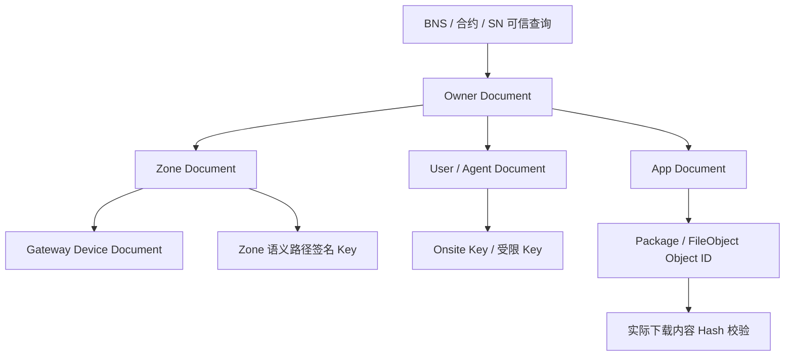
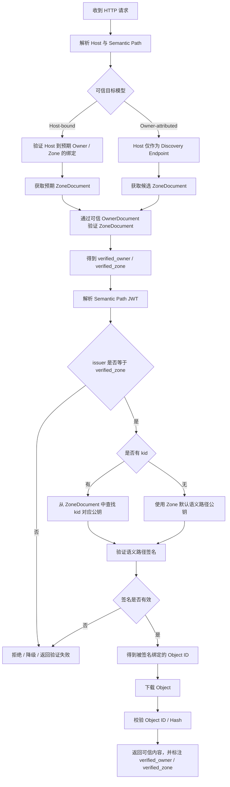
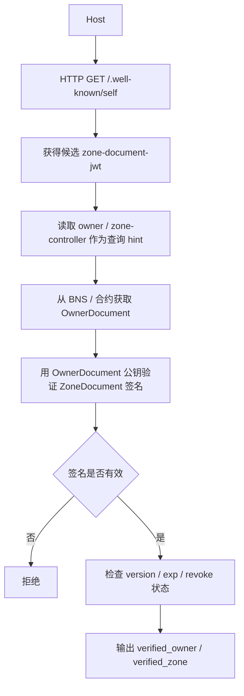
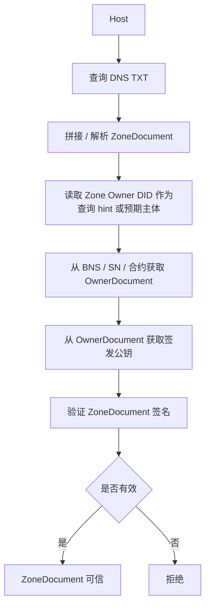
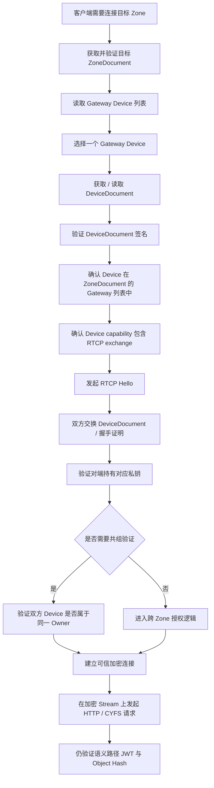
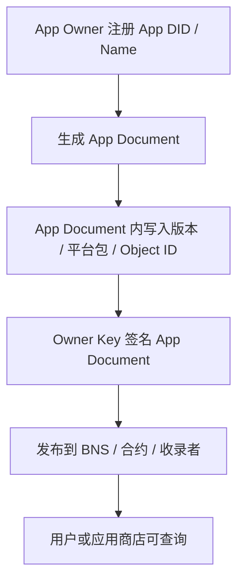
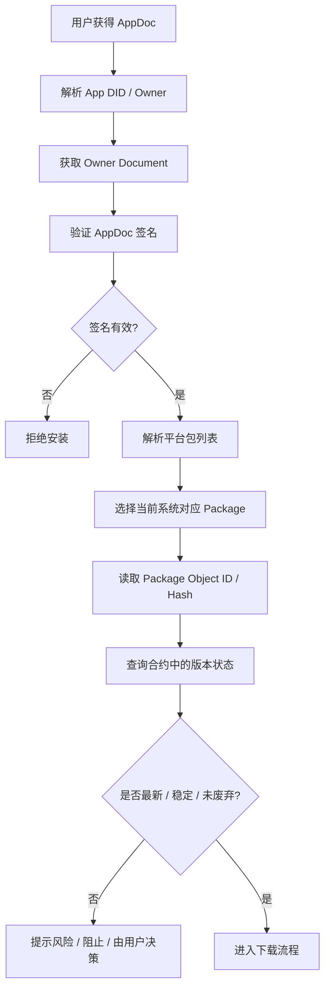
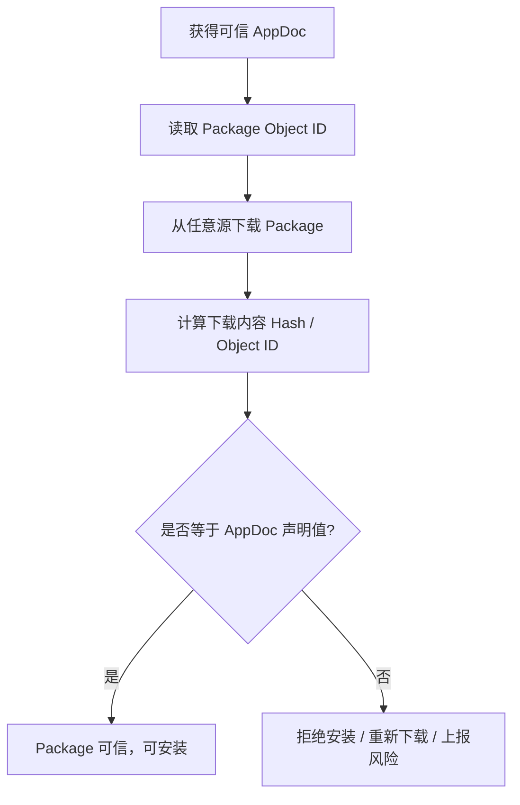

# CYFS 内容网络的去中心化可信验证流程


---

## 1. 背景与整理目标

当前 CYFS 协议栈里，很多模块已经有“签名—验签”的局部逻辑，但真实环境下，一个内容请求、一个 Zone 文档解析、一次 RTCP 连接、一次 App 安装，都不是单点验签，而是一条连续的可信链。

本整理的目标是回答四个问题：

1. **验证谁？** 语义路径、Zone Document、Owner Document、Device Document、User/Agent Document、App Document、Package/FileObject 分别由谁签发。
2. **用哪把公钥验证？** 从 HTTPS、DNS、SN/BNS、JWT 的 `issuer` / `pid` / `kid`、Zone Document、Owner Document 中如何查找公钥。
3. **什么时候必须验证？** HTTP、非 HTTPS Zone Document、跨 Zone 下载、AppDoc 安装、付费下载、RTCP 建链等边界。
4. **什么时候可以绕过？** HTTPS 传输可信、SN/BNS 合约可信、Zone 内部开发模式缓存等例外条件。


### 例子1：不用 HTTPS 搭建 Owner-attributed 的可信内容发布

本例使用 **Owner-attributed 模式**，也就是：

- `http://zhicong.me` 只是访问入口 / discovery endpoint，不是信任根；
- 客户端首次访问时，不预设 `zhicong.me` 一定属于哪个 Owner；
- HTTP 返回的 ZoneDocument 只是候选文档；
- ZoneDocument payload 中的 `zone-controller` / `owner` 在验签前只作为 OwnerDocument 查询 hint；
- 验签完成后，可信身份是 `verified_owner` / `verified_zone`；
- 信用、支付、权限、审计、UI 展示身份都应绑定到 `verified_owner` / `verified_zone`，而不是绑定到裸 Host。

如果业务目标是“`zhicong.me` 必须绑定到 `did:bns:zhicong`”，那属于 **Host-bound 模式**，需要额外的 Host 绑定证明，例如 HTTPS、DNSSEC、BNS 反向绑定、客户端 pin、TOFU cache 等。本例不假设这一点。

#### 发布者

- 在 BNS 上注册名字 `did:bns:zhicong`，合约调用由 Owner 钱包私钥完成。
- 更新 `did:bns:zhicong` 的 OwnerDocument，声明默认 Zone 为 `did:web:zhicong.me`，并可声明 ZoneDocument 的版本状态，例如 `latest_zone_doc_version`、`min_valid_zone_doc_version`、`latest_zone_doc_hash`、`revoke_after` 等。
- 在 VPS 上生成 Gateway Device 密钥对，构造 `gateway-device-document`，由 Owner 私钥签名，或由 Owner 授权的 Zone / Device 签发 Key 签名。DeviceDocument 中声明 RTCP exchange key 与 `rtcp_gateway` capability。
- 在 VPS 上生成 Zone 密钥对，构造 `zone-document`，由 Owner 私钥签名。ZoneDocument 至少声明：
  - `zone_did = did:web:zhicong.me`；
  - `owner = did:bns:zhicong`；
  - 语义路径签名 Key 列表与默认 Key；
  - Gateway Device 列表，例如 `ood1`；
  - 可选的 discovery host，例如 `zhicong.me`，该字段在 Owner-attributed 模式下只是说明“这个 Host 曾返回该 ZoneDocument”，不是独立信任根。
- 在 `zhicong.me -> VPS` 上启动 HTTP 服务。HTTP 服务支持 CYFS 扩展的 `.well-known` 查询器，可以返回 `did:web:zhicong.me` 的候选 `zone-document-jwt`。
- VPS 的 HTTP 服务器启动 `cyfs-dir-server`。所有语义路径都返回 Semantic Path JWT，JWT 的验证公钥在已验证的 ZoneDocument 中。
- VPS 使用 `gateway-device-document` 启动 RTCP stack。

> 注意：这里使用 `did:web:zhicong.me` 作为 Zone DID / Host DID 的命名形式。由于本例不使用 HTTPS，不能依赖 DID Web 的 HTTPS 传输可信性；HTTP 只负责搬运候选文档，真正可信性来自 BNS OwnerDocument 与 Owner 对 ZoneDocument 的签名。

#### 客户公开获取内容：不在乎被窃听，希望不会被篡改

1. 客户端发起 HTTP 请求：

   ```text
   http://zhicong.me/ndn/dir1/file1
   ```

2. CYFS HTTP Response header 中返回：

   ```text
   semantic_path_jwt: /ndn/dir1/file1 的语义路径 JWT
   object_id: file1 的 objid
   ```

   `object_id` 必须包含在 Semantic Path JWT 的签名 payload 中。客户端不能信任裸 HTTP header 中未被签名覆盖的 `object_id`。

3. 客户端调用：

   ```text
   discover_zone_document_from_host("zhicong.me")
   ```

   流程如下：

   ```text
   通过 http://zhicong.me/.well-known/self 获取候选 zone-document-jwt
       ↓
   在验签前，不信任 payload 中的业务声明；
   只把 payload 中的 zone-controller / owner 当作 OwnerDocument 查询 hint
       ↓
   根据 hint，例如 did:bns:zhicong，调用 resolve_did("did:bns:zhicong", DOC_TYPE_OWNER)
       ↓
   通过 BNS / 合约获得可信 OwnerDocument
       ↓
   使用 OwnerDocument 中的公钥验证 zone-document-jwt 签名
       ↓
   校验 ZoneDocument 的自洽性：zone_did、owner、version、iat、exp、capability 等字段
       ↓
   如果 OwnerDocument / BNS 状态声明了 latest / min_valid / hash / revoke_after，继续校验新鲜度
       ↓
   验证通过后，输出 verified_owner = did:bns:zhicong，verified_zone = did:web:zhicong.me
   ```

   这一步完成后可以缓存，但缓存项应记录：

   ```text
   discovery_host = zhicong.me
   verified_owner = did:bns:zhicong
   verified_zone = did:web:zhicong.me
   zone_document_hash
   version
   exp / ttl
   BNS 状态高度或时间
   ```

   在 Owner-attributed 模式下，`zhicong.me` 是发现入口，不是信用主体。缓存命中时仍应遵守 `exp`、TTL、BNS 版本状态和吊销约束。

4. 验证 Semantic Path JWT：

   ```text
   issuer 必须等于 verified_zone (基于当前域名，或上级域名的zoneid,不写就是当前host zone)
   kid 只能在 verified_zone 的 ZoneDocument 内选择公钥
   如果没有 kid，则使用 ZoneDocument 的默认语义路径签名 Key
   JWT payload 必须覆盖 host、path、object_id、iat、exp 等字段
   ```

   验证通过后，客户端确认：

   ```text
   /ndn/dir1/file1 -> object_id
   ```

5. 下载 `file1` 数据：

   ```text
   可以从 HTTP、镜像、CDN、P2P、多源下载
   下载后计算 hash(file1)
   验证 hash(file1) == object_id
   ```

   只要 Hash 匹配，内容字节可信；内容归属可信主体为 `verified_owner` / `verified_zone`。

#### 攻击者替换 Owner 时的语义

攻击者可以拦截 HTTP，并替换：

```text
zone-document-jwt
semantic_path_jwt
object_id
file bytes
```

如果攻击者替换为自己 Owner 签发的 ZoneDocument，那么最终验证结果会变成：

```text
verified_owner = did:bns:attacker
verified_zone = attacker_zone
```

这不会继承 `did:bns:zhicong` 的信用、支付归属或权限。也就是说，本模式保证的是：

```text
当前返回内容可以归属到某个经过 BNS 验证的 Owner。
```

它不保证：

```text
zhicong.me 这个 Host 必然属于 did:bns:zhicong。
```

因此，应用 UI 与业务逻辑必须展示和使用 `verified_owner` / `verified_zone` 作为信用主体，不能只显示“来自 zhicong.me”。如果业务确实需要 Host 身份可信，应切换到 Host-bound 模式。

#### 客户私有获取内容：在乎被窃听

客户端可以基于：

```text
rtcp://zhicong.me/:80
```

发起同样的 HTTP 请求。RTCP 解决的是传输加密与对端 Device 身份，不替代语义路径 JWT 验证和 Object Hash 校验。

流程：

```text
客户端有自己的 device_doc
    ↓
先执行 discover_zone_document_from_host("zhicong.me")，得到已验证的 ZoneDocument
    ↓
从 ZoneDocument 的 gateway_devices 列表中选择 Gateway，例如 ood1
    ↓
获取 ood1 的 DeviceDocument，可以来自 HTTP / Zone 查询器 / 其他源
    ↓
验证 DeviceDocument：
    1. DeviceDocument 由 Owner Key 签发，或由 ZoneDocument 中授权的 Device Signing Key 签发；
    2. Device DID / name 出现在当前 ZoneDocument 的 gateway_devices 列表中；
    3. DeviceDocument 中的 exchange key 具备 RTCP 建链能力；
    4. DeviceDocument 未过期、未被吊销。
    ↓
RTCP Hello 阶段，Gateway 必须证明自己持有 ood1 DeviceDocument 对应私钥
    ↓
双方完成 ECDH，建立加密 stream
    ↓
在 stream 上发起 HTTP 请求：/ndn/dir1/file1
    ↓
后续仍执行 Semantic Path JWT 验证与 hash(file1) == object_id 校验
```

#### 实现传统吊销语义：防止 JWT 重放攻击

Owner-attributed 模式下，攻击者替换成另一个 Owner 并不能继承原 Owner 的信用；更重要的攻击是重放同一 Owner 过去签发过的旧 ZoneDocumentJwt 或旧 Semantic Path JWT。

需要明确：

```text
签发新版 ZoneDocumentJwt 本身，不会让旧 JWT 在密码学上自动失效。
```

旧 JWT 只要签名正确，在没有新鲜度约束时仍可能被重放。因此需要可信的新鲜度来源。

推荐规则：

- `zone-document-jwt` 中包含：
  - `version` / `seq`；
  - `iat`；
  - `nbf`；
  - `exp`；
  - `zone_doc_hash`。
- BNS / 合约中的 OwnerDocument 或 Owner 状态可声明：
  - `default_zone`；
  - `latest_zone_doc_version`；
  - `min_valid_zone_doc_version`；
  - `latest_zone_doc_hash`；
  - `revoke_after`。
- Resolver 只有在能查询到 BNS / 合约最新状态时，才能及时拒绝旧版本 JWT。
- 如果客户端暂时无法同步最新 BNS 状态，吊销及时性会受 cache TTL、JWT `exp`、区块同步延迟影响，旧 JWT 可能在窗口期内被重放。
- 紧急吊销可以通过 OwnerDocument / 合约状态声明“某版本或某时间以后的 ZoneDocumentJwt 才有效”，代价是需要一次上链或可信状态更新成本。

Resolver 的缓存策略应表述为：

```text
在 resolver 能查询到 BNS 最新状态，并且 ZoneDocumentJwt 带单调 version / seq 的情况下，
resolver 只缓存满足 latest / min_valid / hash / exp 约束的最新有效 ZoneDocumentJwt。
```

不要把本地“能拿到的最新版本”本身当成防重放保证。


---

## 2. 核心可信模型

### 2.1 可信链总览

CYFS 内容网络里的可信根，可以理解为：



这里的关键点是：

- **BNS / 合约 / SN** 提供顶层可信根。通过 BNS DID 获取到的 Owner Document 可视为系统根信任的一部分。
- **Owner Document** 中的 Owner 公钥具备“CA 级”含义：它不仅用于财务收款，也可以签发 Zone、App、User、Agent、Device 等下级文档。
- **Zone Document** 描述一个 Zone 在内容发布、语义路径解析、Gateway 连接等场景下可以使用哪些公钥。
- **Device Document** 主要解决连接拓扑与 RTCP 建链可信问题。
- **App Document** 主要解决应用内容、版本、包文件 Object ID、安装权限与可信发布问题。
- **User / Agent Document** 主要解决 Zone 内二级主体的发布能力、驻留关系与受限签名能力。

### 2.2 DID 层级

| 层级 | 对象 | 特点 | 典型用途 |
|---|---|---|---|
| 一级 DID | Owner | 建议上链，全网唯一，是信任根和财务归属主体 | 收款、签发下级 Document、权益转移 |
| 一级 DID | Zone | 建议具备全网唯一身份，可通过 Host / DID 关联 | 语义路径发布、Zone 级内容服务 |
| 一级 DID | App | 高价值应用建议注册为一级 DID | 独立流转、付费、版本发布、跨 Zone 使用 |
| 二级 DID | Device | 隶属于某个 Owner / Zone，不一定需要独立域名 | Gateway、RTCP 连接、拓扑证明 |
| 二级 DID | User | 可链上注册，也可只驻留在某个 Zone 中 | 用户内容发布、联合登录、驻留证明 |
| 二级 DID | Agent | 通常不上链，依赖 Zone 存在 | 自动化代理、应用内账户、受限发布 |

二级 DID 的核心价值是**限定签名能力的有效空间**。例如：`bob.example-zone` 这样的二级名字表达的是：Bob 的签名能力只在对应 Zone 或 Hostname 命名空间下有效，不能越权代表整个 Owner 或整个 Zone。

### 2.3 三种可信目标模型

同一条访问链可能服务于不同的安全目标。为了避免把所有 HTTP 场景都误解成“Host 必须先绑定到 Owner”，建议把可信目标拆成三种模式。

| 模式 | 用户真正信任什么 | Host 的角色 | 需要证明什么 | 典型场景 |
|---|---|---|---|---|
| Host-bound 模式 | Host / 域名身份 | 信任入口 | `host -> expected_owner / expected_zone` 的绑定关系 | 传统网站、品牌域名、需要确认 `zhicong.me` 必属某 Owner 的业务 |
| Owner-attributed 模式 | 验签后得到的 Owner / Zone | Discovery endpoint | 当前内容可归属到某个经过 BNS 验证的 `verified_owner` / `verified_zone` | 不用 HTTPS 的公开内容发布、普通内容发现 |
| Object-only 模式 | Object ID / Hash | 任意下载源 | 下载字节是否匹配已知 Object ID | App Package、P2P 内容块、多源镜像 |

三者的差异在于：

```text
Host-bound：先知道或验证 Host 应该属于谁，再验内容。
Owner-attributed：先通过 Host 发现候选文档，验签后才知道内容属于谁。
Object-only：不关心发布者，只关心字节是否匹配已知 Hash。
```

因此，HTTP 并不天然要求先证明 `Host -> Owner` 绑定。只有当业务目标是 Host 身份可信时，才必须额外证明该绑定。若业务目标是 Owner-attributed 内容可信，则 Host 可以只是发现入口；信用、支付、权限、UI 展示都必须绑定到验签后的 `verified_owner` / `verified_zone`。

---

## 3. 关键文档与密钥类型

### 3.1 Owner Document

Owner Document 是顶层身份文档，通常应满足：

- 自签名；
- 发布到 SN / BNS / 合约；
- 可通过 Owner DID 查询；
- 包含 Owner 的核心公钥；
- 可声明若干下级用途 Key，例如用于签发 Zone Document、App Document、User/Agent Document、Onsite Key 等。

Owner 公钥有两个典型职责：

1. **财务职责**：内容、应用、服务的收益通常打到 Owner 对应地址。
2. **签发职责**：Owner 可签发 Zone、App、Device、User、Agent 等 Document，类似传统 CA 给下级证书签名。

### 3.2 Zone Document

Zone Document 描述一个 Zone 的可信配置，至少应能表达：

- Zone 的 DID；
- Zone 的 Owner DID；
- 可选的 Hostname / discovery host 声明；
- 默认签名公钥；
- 可选的多个业务 Key；
- Gateway Device 列表；
- RTCP 所需的 Exchange Key / Device Document 引用；
- 语义路径签名校验所需的 `kid` 映射；
- 版本号、过期时间、吊销相关状态引用。

需要特别区分 Host-bound 与 Owner-attributed 两种语义：

| 场景 | ZoneDocument 中 Host / Owner 字段的作用 |
|---|---|
| Host-bound 模式 | Host 已经通过 HTTPS / DNSSEC / BNS 反向绑定 / pin / TOFU 等方式绑定到预期 Owner / Zone。ZoneDocument 必须与这个预期绑定一致。 |
| Owner-attributed 模式 | Host 只是发现入口。ZoneDocument 中的 `owner` / `zone-controller` 在验签前只能作为 OwnerDocument 查询 hint；验签完成后，输出 `verified_owner` / `verified_zone`。 |

在 Zone 语义路径验证中，`issuer` 不宜被滥用为具体 Key 选择器。更合理的规则是：

- 先确定语义路径签发主体：
  - Host-bound 模式下，主体来自 Host 绑定到的 Zone；
  - Owner-attributed 模式下，主体来自已验证 ZoneDocument 的 `verified_zone`。
- Semantic Path JWT 的 `issuer` 必须等于已经确定的 Zone 主体；
- 如果同一个 Zone 下有多把公钥，应使用 `kid` 在该 ZoneDocument 内选择具体 Key；
- 如果没有 `kid`，使用 ZoneDocument 中的默认语义路径签名 Key；
- 不应让 JWT 自己声明一个尚未验证的 `issuer` 并直接获得信任。

### 3.3 Device Document

Device Document 用于连接与拓扑验证，重点不是内容归属，而是证明：

- 某个 Gateway Device 属于某个 Zone / Owner；
- 某个 RTCP 对端确实持有对应私钥；
- 两个 Device 是否属于同一个 Owner，即“共组验证”；
- 私有内容传输是否可以建立端到端加密信道。

### 3.4 App Document

App Document 是应用安装流程的起点，包含：

- App 的唯一名字 / DID；
- App Owner；
- App 签名；
- 平台相关包列表；
- 每个包的 FileObject / Object ID / Hash；
- 版本号；
- 可选的 Source URL；
- 可选的收录证明、下载证明、付费证明要求、权限声明等。

### 3.5 Onsite Key / 受限 Key

Onsite Key 是为了避免把高权限 Owner 私钥放在 Zone 上而设计的受限私钥。

典型场景：

- Bob 是一个链上 Owner，但 Bob 驻留在某个 Zone 中发布内容；
- Bob 不应把链上 Owner 私钥存到该 Zone；
- Bob 可以在自己的 Owner/User Document 中声明一个 `onsite` 公钥；
- 对应私钥保存在 Zone 的可信存储区；
- 该 Key 的能力范围可以被限制为“内容发布”“安装操作”“Zone 内管理”等，不允许做财务转账。

---

## 4. HTTP / HTTPS 内容请求的可信验证流程

### 4.1 分支原则

一个面向 Zone 的内容请求，本质上可以抽象为：

```text
请求 URL / Host / Semantic Path
    → 根据可信目标模型处理 Host
    → 找到候选或预期 Zone Document
    → 验证 Zone Document，得到 verified_owner / verified_zone
    → 找到用于验证语义路径签名的公钥
    → 验证 Semantic Path 是否绑定到目标 Object ID
    → 下载对象
    → 校验对象内容
```

其中 HTTPS 与 HTTP 的差异在于：

| 访问方式 | 基本判断 | 是否仍可强验证 |
|---|---|---|
| HTTPS | 传输层可提供 Host 身份可信，适合 Host-bound 模式 | 可以；强验证模式下仍验证 Document 签名和语义路径签名 |
| HTTP | 传输层不可信，不能单独证明 Host 身份 | 必须验证 CYFS 文档签名、语义路径签名和 Object Hash |
| RTCP | 可提供加密传输和 Device 身份验证 | 仍不替代语义路径签名和 Object Hash 校验 |

HTTP 场景下必须先明确当前安全目标：

```text
Host-bound 模式：要证明请求 Host 属于预期 Owner / Zone。
Owner-attributed 模式：Host 只用于发现候选 ZoneDocument，验签后才知道内容属于谁。
Object-only 模式：只校验下载内容是否匹配已知 Object ID。
```

从传输加速角度，HTTP 仍然可以使用；但 HTTP 只能作为不可信传输，必须补齐 CYFS 自身的可信验证。

### 4.2 HTTP 语义路径验证流程



### 4.3 JWT 中 `issuer` / `pid` / `kid` 的建议语义

JWT 内可能包含 `issuer`、`pid`、`kid` 等字段，它们都可能参与公钥查找。为了避免越权，建议整理为以下规则：

| 字段 | 建议用途 | 约束 |
|---|---|---|
| `issuer` | 表示签发主体 | 必须等于已经确定的 `verified_zone`、Owner、User 或 App 主体；不能单独决定信任主体 |
| `pid` | 可作为主体或对象定位器 | 可辅助查找 Document，但不能单独决定签名权限 |
| `kid` | 在已确定主体的 Document 内选择具体 Key | 只能在已经确认的 Zone / Owner / User / App Document 内选择 |

更精确的原则是：

```text
Host-bound 模式：
    先由 Host 绑定关系确定 expected_zone；
    ZoneDocument 验证通过后得到 verified_zone；
    Semantic Path JWT 的 issuer 必须等于 verified_zone。

Owner-attributed 模式：
    Host 只用于发现候选 ZoneDocument；
    ZoneDocument 通过 BNS OwnerDocument 验证后得到 verified_zone；
    Semantic Path JWT 的 issuer 必须等于 verified_zone。

两种模式共同要求：
    kid 只能在 verified_zone 的 ZoneDocument 内选 Key；
    不能让 JWT 自己声明一个未验证主体并直接获得信任。
```

### 4.4 Semantic Path JWT 的签名覆盖范围

为了避免 HTTP Header 被替换，Semantic Path JWT 的 payload 至少应覆盖：

```text
host 或 discovery_host
path
object_id
issuer / zone_did
kid 或 key usage
capability / namespace
iat / nbf / exp
可选：content_type、content_length、version、cache 策略
```

客户端最终使用的 `object_id` 应来自签名 payload，或必须与签名 payload 中的 `object_id` 完全一致。裸 HTTP Header 中未被签名覆盖的 `object_id` 只能作为提示，不能作为可信结果。


---

## 5. Zone Document 的获取与验证

### 5.1 获取路径

客户端需要先得到可验证的 ZoneDocument。常见路径包括：

| 获取方式 | 适用场景 | 是否需要额外签名验证 | 说明 |
|---|---|---|---|
| HTTPS 下的 W3C 标准入口 | Zone 支持 HTTPS，且业务使用 Host-bound 模式 | 普通模式可不需要；强验证模式可要求 | HTTPS 证书链提供 Host 传输可信；强验证模式仍建议回溯 Owner 签名 |
| HTTP `.well-known` Discovery | 不使用 HTTPS，Host 只是发现入口 | 必须 | HTTP 返回候选 ZoneDocument；`owner` / `zone-controller` 只作为 OwnerDocument 查询 hint；最终归属到 `verified_owner` / `verified_zone` |
| DNS TXT Record | 无 HTTPS，但可读 DNS | 需要 | DNS 记录可能被篡改，必须验证 Document 自身签名；若需 Host-bound，还需 DNSSEC 或其他绑定证明 |
| SN / Web3 网桥接口 | CYFS 可管理的 Web3 网桥域名 | 通常不需要；强验证模式可要求 | 通过 SN 的 HTTPS 查询接口或合约可信查询获得 |
| BNS / 合约直接声明 | Owner 或 Zone 状态直接上链 | 通常可信；强验证模式可要求文档签名 | 适合高价值 Zone 或需要强吊销语义的场景 |

所有路径最终都可以收敛为：

```text
获取候选或预期 ZoneDocument
    → 确定或查询 OwnerDocument
    → 验证 ZoneDocument 签名
    → 检查版本 / 过期 / 吊销状态
    → 输出 verified_owner / verified_zone
```

### 5.2 通过 HTTPS 获取

如果 Zone 支持 HTTPS：

1. 客户端访问当前 Host 下的标准 DID Document URL；
2. HTTPS 证书链保障 Host 与响应内容的传输可信；
3. 获取 ZoneDocument；
4. 普通模式下可以直接使用；
5. 强验证模式下，仍要求 ZoneDocument 带 Owner 签名，并通过 OwnerDocument 验证；
6. 如果业务是 Host-bound 模式，仍应确认 ZoneDocument 中的 Zone DID / Owner 与预期 Host 绑定关系一致。

### 5.3 通过 HTTP `.well-known` Discovery 获取

HTTP `.well-known` Discovery 适合 Owner-attributed 模式。它的核心语义是：

```text
HTTP 只提供候选 ZoneDocument，不提供 Host 身份可信性。
```

流程：



注意事项：

- 在 ZoneDocument 签名验证前，不信任 payload 中的业务声明；
- `owner` / `zone-controller` 可以用于定位 OwnerDocument，但不能在验签前作为可信结论；
- 验证通过后，内容信用绑定到 `verified_owner` / `verified_zone`；
- 如果上层业务需要确认 Host 身份，则必须额外走 Host-bound 验证。

### 5.4 通过 DNS TXT Record 获取

如果没有 HTTPS，可以通过 DNS TXT Record 查找 ZoneDocument。此时必须考虑：

- DNS 记录大小有限，可能需要分片拼接；
- DNS 记录可能被缓存、污染或篡改；
- 因此 TXT Record 返回的 ZoneDocument 必须自带签名；
- 验签公钥应来自可信 OwnerDocument；
- OwnerDocument 通过 BNS / SN / 合约获取；
- 如果业务需要 Host-bound 身份可信，应使用 DNSSEC 或其他可验证绑定机制。

流程：



### 5.5 通过 SN / Web3 网桥获取

如果域名属于 CYFS Web3 网桥可管理范围，可以通过 SN 接口查询 ZoneDocument。由于 SN 查询接口本身可以走 HTTPS，且底层可关联合约数据，因此普通模式下可直接视为可信来源。

但在强验证模式下，建议仍统一执行：

```text
ZoneDocument → 读取 Owner DID → 获取 OwnerDocument → 验证 ZoneDocument 的 Owner 签名
```

这样 HTTP、HTTPS、DNS、SN 与 BNS 的路径会收敛到同一套验证模型。


---

## 6. Owner Document 与 BNS 可信根

### 6.1 Owner Document 的定位

Owner Document 的获取是 CYFS 系统特定过程：

```text
Owner DID / BNS Name → SN / BNS / 合约查询 → Owner Document
```

由于这是顶层可信根，语音记录中把它类比为传统 CA 体系里的根证书链：

- BNS / 合约类似 CA 机构；
- Owner 公钥类似 CA 级公钥；
- Zone / App / User / Agent / Device Document 类似 Owner 签发的下级证书；
- 下级文档的可信性来自 Owner Document 中的公钥。

### 6.2 普通模式与强验证模式

| 模式 | 规则 |
|---|---|
| 普通模式 | HTTPS 来源 Document 可在 Host-bound 普通场景下直接使用；BNS / SN / 合约数据可直接使用；HTTP `.well-known` 与 DNS TXT 返回的 Document 必须验签 |
| 强验证模式 | 除 OwnerDocument 外，所有 Document 都应有 Owner 签名或 Owner 授权签名，并且必须回溯到可信 OwnerDocument 验证 |
| 开发模式 | Zone 内已存在对象可在受控条件下绕过部分验证；不应用于生产环境 |

强验证模式的意义在于：即使传输路径可信，也能证明文档本身属于正确 Owner，避免不同信任域之间的实现差异。Owner-attributed 模式下，强验证还要求输出并使用 `verified_owner` / `verified_zone`；Host-bound 模式下，强验证还要求 Host 与预期 Owner / Zone 的绑定一致。

---

## 7. Zone Gateway 与 RTCP 验证流程

### 7.1 为什么需要 RTCP

CYFS 除 HTTP 访问外，还支持 RTCP。RTCP 可以被看作在无证书场景下对 TLS 的替代：

- HTTP / HTTPS 主要解决公开内容传输；
- RTCP 主要解决 Zone 与 Zone、Device 与 Device 之间的私有内容传输；
- RTCP 建链时需要交换 DeviceDocument，并通过 DID 信任链确认对端身份；
- RTCP 只解决传输加密和对端 Device 身份，不替代 Semantic Path JWT 验证和 Object Hash 校验。

### 7.2 RTCP 建链的关键对象

```text
已验证的 ZoneDocument
    → Gateway Device 列表
    → Gateway DeviceDocument
    → Exchange Key / Device Public Key
    → RTCP Hello 阶段完成身份交换、持钥证明与密钥协商
```

一个 Zone 可以有多个 Gateway Device。客户端连接 Zone 的本质，是连接该 Zone 的某个 Gateway Device。

DeviceDocument 的可信性和 Gateway 身份需要同时满足：

```text
DeviceDocument 本身由可信 Owner / Zone 授权 Key 签发
Device DID / name 出现在当前 ZoneDocument 的 gateway_devices 列表中
DeviceDocument 声明具备 rtcp_gateway / exchange_key capability
RTCP 握手阶段对端证明持有对应私钥
```

仅仅“拿到一个 Owner 签过的 DeviceDocument”还不足以说明它是当前 Zone 的 Gateway；必须同时被当前 ZoneDocument 列为 Gateway。

### 7.3 RTCP 验证步骤



### 7.4 共组验证

“共组验证”指两个 Device 都属于同一个 Owner，并且：

- 两个 DeviceDocument 都能被同一个 OwnerDocument 中的公钥验证，或都能回溯到同一个可信 Owner；
- 两个 Device 都能证明自己持有对应私钥；
- 所属 Owner 与目标 Zone 的访问策略匹配。

它是区分 **Zone 内流量** 与 **Zone 外流量** 的核心机制：

- Zone 内：可走更直接的信任与授权逻辑；
- Zone 外：必须走跨 Zone 认证、权限、付费、下载证明等额外逻辑。


---

## 8. 二级 DID：User / Agent / Onsite Key

### 8.1 User 驻留在 Zone 内的发布流程

以 Bob 为例：

```text
Bob 是一个用户 / Owner
Bob 驻留在某个 Zone
Bob 在该 Zone 内发布内容
请求 Host 或语义路径中出现 bob.zone-name
JWT issuer = Bob 或 kid 指向 Bob 的某个 Key
```

此时有两种情况。

#### 情况 A：Bob 有链上 Owner Document

1. 通过 Bob DID 从 BNS / SN / 合约获取 Bob 的 Owner Document；
2. 从 Bob Document 中找到对应 `kid` 的公钥；
3. 验证 Bob 对语义路径或内容发布声明的签名；
4. 同时检查 Bob 与该 Zone 的驻留关系是否被双向声明。

#### 情况 B：Bob 只是 Zone 内二级用户

1. 通过 Zone Document 或 Zone 内标准 W3C DID 入口获取 Bob 的 User Document；
2. 验证 Bob User Document 是否由 Zone Owner 或授权 Onsite Key 签发；
3. 从 Bob User Document 中找到 Bob 的发布 Key；
4. 验证 Bob 的语义路径签名；
5. 签名只在 Bob 的二级命名空间下有效。

### 8.2 双向绑定

用户入住某个 Zone，不应只由 Zone 单方面声明，也不应只由用户单方面声明。可信的驻留关系建议是双向绑定：

```text
Zone Document / Zone Account Registry 声明：Bob 是本站用户
Bob Owner/User Document 声明：Bob 在该 Zone 有 onsite key / account / residency
```

这样可以避免：

- Zone 冒充某个用户；
- 用户否认曾经授权某个 Zone；
- Onsite Key 的权限边界不清晰。

### 8.3 Onsite Key 的能力边界

Onsite Key 不应默认等同 Owner Master Key。建议在 Document 中声明能力范围：

| 能力 | 是否适合 Onsite Key | 说明 |
|---|---|---|
| 内容发布 | 适合 | 典型用途 |
| 语义路径签名 | 适合 | 限定在二级命名空间下 |
| 安装 / 添加 Agent | 适合，但需授权 | Zone Owner 的 onsite key 可用于 Zone 内管理 |
| 财务收款 | 可绑定地址，但不建议自动花费 | 收款通常打给 Owner |
| 财务转账 | 不适合 | 应由 Owner Master Key 或显式授权完成 |
| 全局 DID 转移 | 不适合 | 权限过高 |

---

## 9. Agent / Jarvis 类对象的可信关系

Agent 通常是纯二级对象，不一定上链。它依赖 Zone 存在，典型获取方式是：

```text
Zone Host / W3C DID 入口 → Agent Document
```

Agent Document 通常应由以下之一签发：

- Zone Owner Master Key；
- Zone Owner 的 Onsite Key；
- 已授权的 Zone 管理 Key。

语音记录中特别指出，Owner Master Key 往往与财务强绑定，放在 Zone 中风险太大。因此实际部署中更合理的是：

- Zone Owner Master Key 保留在 Owner 手中；
- Zone 内保存一个受限 Onsite Key；
- Onsite Key 可安装 Agent、添加二级对象、做内容发布类操作；
- 高风险财务操作仍需 Owner Master Key 或外部授权。

### 9.1 Agent 的两类 Key

Agent 可以有两类 Key：

| Key | 用途 | 私钥保存位置 |
|---|---|---|
| Agent Onsite Key | Zone 内运行、发布、轻量授权、小额钱包 | Zone 可信存储区 |
| Agent Master Key | Agent 作为独立实体的高权限身份 / 财务权利 | Owner 或外部安全环境 |

在未来需要支持 Agent 自主消费时，可以把 Onsite Key 视为“小额零钱包”；当余额不足或权限不足时，Agent 向 Owner 请求授权。

---

## 10. App Document 发布与安装验证流程

### 10.1 App 为什么适合作为一级 DID

普通照片、文章、临时内容可以是 Zone 内二级发布对象，但 App 往往具有更高价值：

- 构造成本高；
- 面向他人安装使用；
- 可能收费；
- 需要持续版本发布；
- 可能发生权益转移；
- 不应依赖某个单一 Zone 才能被发现或购买。

因此高价值 App 建议注册为一级 DID。其名字可以类似：

```text
author-name-app-name
```

用户只要知道 App 的唯一名字，就可以通过合约直接找到 App Document，而不必依赖某个应用商店。

### 10.2 App 发布可信链



App 的 Owner 可以变更。Owner 变更后，后续收益、版本控制、废弃声明等权利也随 Owner 转移。

### 10.3 App 安装入口

用户安装 App 可以从两类入口开始：

| 入口 | 本质 | 说明 |
|---|---|---|
| App 唯一名字 | 合约查询器 | 用户通过 App DID / Name 直接查到 AppDoc |
| 应用商店 / 收录者 | AppDoc 索引器 | 应用商店提供浏览、搜索、推荐、信用背书 |

应用商店在 CYFS 体系里不是唯一信任源，它更像是“内容收录者”。它的核心价值是发现、排序、推荐、审核与背书，而不是垄断安装权。

### 10.4 安装器验证流程



安装验证至少包含两件事：

1. **AppDoc 签名正确**：证明 AppDoc 由正确 Owner 发布。
2. **AppDoc 内容可解析且状态可信**：包括版本、平台包、Object ID、合约状态、是否废弃等。

### 10.5 版本状态与权利回归

AppDoc 一旦被签名，其内容本身不可变。但合约中可以维护 App 版本状态，例如：

- 当前最新版本；
- 稳定版本；
- 测试版本；
- 已废弃版本；
- 被召回版本；
- Owner 变更历史。

这意味着：

- 应用开发者保留发布新版本的权利；
- 应用开发者可把某个旧版本标记为废弃；
- 应用商店可以表达自己的收录意见；
- 用户最终看到的是“开发者状态 + 收录者信用 + 系统验证结果”的组合判断。

### 10.6 收录证明与双向收录

收录者可以给 AppDoc 提供收录证明，App 开发者也可以在查询 AppDoc 时返回更多收录证明。每一次高质量收录都是一种信用保障。

建议未来安装器 UI 展示：

```text
AppDoc 签名：有效 / 无效
Owner：可信 / 未知 / 已变更
版本状态：最新 / 稳定 / 废弃 / 风险
收录者：A、B、C
收录者信用：高 / 中 / 低
支付状态：已支付 / 未支付 / 免费
下载源：收录者缓存 / Owner Zone / 其他镜像
Package Hash：匹配 / 不匹配
```

---

## 11. App Package 下载与校验流程

### 11.1 下载源优先级

当 AppDoc 已被验证可信后，Package 下载可以从多个源进行：

1. **收录者 Zone 缓存**：如果 AppDoc 是从某个收录者获得，优先从收录者的 Zone 缓存下载；
2. **App Owner 的 Default Zone**：通过 Owner 或 AppDoc 声明的默认 Zone 下载；
3. **AppDoc 中的 Source URL**：可选字段，可以是 HTTPS / HTTP / 语义链接；
4. **Object ID 下载服务**：直接根据 Object ID 拉取；
5. **其他镜像 / CDN / P2P 源**：只要最终 Hash 校验通过即可。

### 11.2 下载时可能需要携带的证明

某些下载源不会对所有人开放，需要请求方附带证明：

| 证明 | 用途 |
|---|---|
| 安装证明 / 下载证明 | 证明用户确实正在安装该 App，或来自可信安装器 |
| 支付收据 | 付费 App 下载时证明已支付 |
| 链上交易结果 | 证明付款已在链上完成或支付网关确认成功 |
| 用户 / Device 身份证明 | 用于权限控制、限流、私有下载 |

### 11.3 下载后的最终校验

无论从哪里下载，最终都必须回到 AppDoc 中的 Object ID / Hash：



因此，下载源是否完全可信不是最关键的。关键是：**AppDoc 必须可信，且下载结果必须与 AppDoc 中的 Object ID 一致。**

---

## 12. 验证边界：Zone 与 Zone 之间

### 12.1 基本原则

语音记录中提出一个重要原则：

> 验证边界永远发生在 Zone 与 Zone 之间。

更具体地说：

- 当对象从 Zone 外进入本 Zone 时，必须验证；
- 一旦对象已经被本 Zone 验证并存储，可以复用本 Zone 的可信缓存结果；
- 如果对象来源于本 Zone 内部的开发、上传、测试流程，可以在开发模式下绕过部分签名验证；
- 生产模式不应允许这种绕过被普通应用或病毒利用。

### 12.2 AppDoc 的边界

| 场景 | 处理方式 |
|---|---|
| AppDoc 从 Zone 外下载 | 下载进入本 Zone 的瞬间验证签名 |
| AppDoc 来自应用商店 / 收录者 | 仍然验证 AppDoc Owner 签名；收录者只提供背书 |
| AppDoc 由开发者本地上传 | 开发模式可允许无签名或测试签名 |
| AppDoc 已在本 Zone 内且有可信验证缓存 | 可复用验证结果 |

### 12.3 Package 的边界

| 场景 | 处理方式 |
|---|---|
| Package 从 Zone 外下载 | 必须校验 Object ID / Hash |
| Package 已在本 Zone 内缓存 | 生产模式建议仍校验缓存元数据；开发模式可绕过 |
| Package 与 AppDoc 声明 Hash 不一致 | 拒绝安装 |
| AppDoc 未声明 Object ID | 不建议安装；应视为低可信或不可信 |

语音记录中提到“开发模式下，若 Package 已在本地保存，安装器可不再验证它是否与 AppDoc Hash 一致”。该能力应严格限制在开发模式，并需要明确开关，避免被恶意软件利用。

---

## 13. 推荐的运行模式

### 13.1 普通生产模式

适合大多数用户：

- HTTPS 来源 Document 可在 Host-bound 普通场景下直接使用；
- HTTP `.well-known` 来源 Document 只能作为候选文档，必须验 Owner 签名；
- DNS TXT 来源 Document 必须验签；
- AppDoc 必须验 Owner 签名；
- Package 必须验 Object ID / Hash；
- RTCP 必须验证 DeviceDocument、Gateway 列表关系和对端持钥证明；
- Zone 外进入本 Zone 的对象必须验证；
- Zone 内缓存可复用验证结果，但必须遵守 TTL、exp、版本和吊销状态；
- UI / 业务逻辑应展示和使用 `verified_owner` / `verified_zone`，不能只依赖裸 Host。

### 13.2 强验证模式

适合高安全场景：

- 除 OwnerDocument 外，所有 Document 均要求 Owner 签名或可回溯到 Owner 授权签名；
- HTTPS 只作为传输安全，不替代文档签名；
- ZoneDocument、DeviceDocument、AppDoc、User/Agent Document 都必须回溯到可信 OwnerDocument；
- Host-bound 模式下，必须验证 Host 与 expected Owner / Zone 的绑定一致性；
- Owner-attributed 模式下，必须明确输出 `verified_owner` / `verified_zone`，且不得把裸 Host 当作信用主体；
- `issuer` 必须等于已经验证出的主体；
- 必须使用 `kid` 在已确认主体的 Document 内选 Key；
- 所有下载都校验 Hash；
- 所有版本状态、吊销状态都查询合约或可信状态源确认。

### 13.3 开发模式

适合本地调试、测试包安装、开发者自测：

- 可允许无签名 AppDoc；
- 可允许本地 Package 跳过 Hash 校验；
- 可允许使用测试 Owner / 测试 Zone；
- 但必须有明确 UI 提示；
- 不得默认开启；
- 不得用于付费、公开分发、跨 Zone 安装。

---

## 14. 端到端流程清单

### 14.1 HTTP 内容请求检查清单

- [ ] 请求是否 HTTPS、HTTP、RTCP 还是本地缓存？
- [ ] 当前请求使用 Host-bound、Owner-attributed 还是 Object-only 模式？
- [ ] 如果是 Host-bound 模式，Host 是否绑定到预期 Owner / Zone？
- [ ] 如果是 Owner-attributed 模式，Host 是否仅作为 discovery endpoint？
- [ ] 是否获取到候选或预期 ZoneDocument？
- [ ] ZoneDocument 来源是 HTTPS、HTTP `.well-known`、DNS TXT、SN 还是 BNS / 合约？
- [ ] HTTP / DNS 来源的 ZoneDocument 是否已验证 Owner 签名？
- [ ] 在验签前，是否只把 `owner` / `zone-controller` 当作查询 hint？
- [ ] 验证完成后得到的 `verified_owner` / `verified_zone` 是什么？
- [ ] Semantic Path JWT 中的 `issuer` 是否等于 `verified_zone`？
- [ ] 是否使用 `kid` 在 `verified_zone` 的 ZoneDocument 内选择正确公钥？
- [ ] Semantic Path JWT payload 是否覆盖 host、path、object_id、iat、exp 等关键字段？
- [ ] Object ID 是否来自签名 payload，或与签名 payload 完全一致？
- [ ] 语义路径签名是否有效？
- [ ] 下载内容 Hash 是否匹配 Object ID？
- [ ] UI / 业务逻辑是否使用 `verified_owner` / `verified_zone` 作为信用主体，而不是裸 Host？

### 14.2 Zone Document 检查清单

- [ ] Document 是否声明 Owner DID？
- [ ] Owner DID 在当前模式下是预期主体，还是仅作为查询 hint？
- [ ] OwnerDocument 是否可从 BNS / SN / 合约获取？
- [ ] Document 是否有 Owner 签名或 Owner 授权签名？
- [ ] 是否声明 Zone DID？
- [ ] 是否声明默认 Key？
- [ ] 是否声明可用 `kid` 与 key usage？
- [ ] 是否声明 Gateway Device 列表？
- [ ] Gateway DeviceDocument 是否可验证？
- [ ] 是否包含 version / iat / nbf / exp？
- [ ] 是否满足 BNS / OwnerDocument 中的 latest / min_valid / revoke_after / hash 约束？

### 14.3 RTCP 检查清单

- [ ] 是否先获取并验证目标 ZoneDocument？
- [ ] 是否从 ZoneDocument 获得 Gateway Device 列表？
- [ ] 是否从 Gateway 列表中选择目标 Device，而不是客户端预先无验证地指定？
- [ ] 是否获取 Gateway DeviceDocument？
- [ ] DeviceDocument 是否由可信 Owner / Zone 授权 Key 签发？
- [ ] Device DID / name 是否出现在当前 ZoneDocument 的 Gateway 列表中？
- [ ] DeviceDocument 是否声明 RTCP exchange capability？
- [ ] RTCP Hello 是否完成 Document 交换？
- [ ] 对端是否证明持有对应私钥？
- [ ] 是否需要共组验证？
- [ ] Zone 内 / Zone 外逻辑是否分流？
- [ ] 加密 Stream 上的内容是否仍执行 Semantic Path JWT 与 Object Hash 校验？

### 14.4 User / Agent 检查清单

- [ ] User / Agent 是一级 DID 还是二级 DID？
- [ ] 如果是一级 DID，是否可从 BNS / SN / 合约获取 Document？
- [ ] 如果是二级 DID，是否限定在正确 Zone 命名空间？
- [ ] 驻留关系是否双向绑定？
- [ ] Onsite Key 是否声明能力范围？
- [ ] Onsite Key 是否被用于财务高权限操作？如果是，应拒绝或要求 Owner 授权。

### 14.5 App 安装检查清单

- [ ] AppDoc 从哪里获得：合约、应用商店、URL、Zone 缓存？
- [ ] AppDoc 是否有 Owner 签名？
- [ ] App Owner Document 是否可信？
- [ ] AppDoc 是否声明当前平台 Package？
- [ ] Package 是否有 Object ID / Hash？
- [ ] 合约中该版本状态是否稳定 / 最新 / 未废弃？
- [ ] 是否有收录者背书？
- [ ] 是否需要支付证明？
- [ ] 下载完成后 Hash 是否匹配？
- [ ] 是否处于开发模式绕过？若是，是否明确提示？

---

## 15. 建议落地为统一验证接口

为了避免每个模块各做一段验签，建议将流程抽象为统一的验证上下文。

### 15.1 Verification Context

```text
VerificationContext {
    mode: normal | strong | development,
    trust_model: host_bound | owner_attributed | object_only,
    source_zone: ZoneID?,
    target_zone: ZoneID?,
    transport: https | http | rtcp | local,
    document_type: owner | zone | device | user | agent | app | file,
    discovery_host: Hostname?,
    expected_owner: DID?,
    expected_zone: DID?,
    verified_owner: DID?,
    verified_zone: DID?,
    did: DID?,
    issuer: DID?,
    pid: PID?,
    kid: KID?,
    object_id: ObjectID?,
    required_capability: Capability?,
    payment_receipt: Receipt?,
    collector_proof: CollectorProof?,
    freshness_requirement: latest | ttl_ok | offline_ok
}
```

### 15.2 统一能力函数

建议至少沉淀以下公共函数：

```text
resolve_owner_document(owner_did)
discover_zone_document_from_host(host, mode)
resolve_zone_document(host_or_zone_did, mode, expected_owner?, expected_zone?)
verify_document_signature(document, trusted_owner_document, mode)
verify_document_freshness(document, owner_or_contract_state)
select_public_key(document, verified_subject, issuer, pid, kid)
verify_semantic_path_binding(path, signature, object_id, key)
resolve_gateway_devices(zone_document)
verify_device_document(device_document, owner_document, zone_document)
verify_rtcp_peer_possession(device_document, handshake_proof)
verify_common_owner(device_a, device_b)
verify_app_document(app_document, owner_document, contract_state)
verify_package_hash(package_bytes, expected_object_id)
verify_capability(key, required_capability, namespace)
```

### 15.3 统一验证结果

每次验证应输出结构化结果，便于 UI、日志、缓存和跨模块复用：

```text
VerificationResult {
    status: trusted | untrusted | warning | development_bypass,
    trust_model: host_bound | owner_attributed | object_only,
    trust_root: bns | https | sn | dnssec | local_dev,
    discovery_host: Hostname?,
    verified_owner: DID?,
    verified_zone: DID?,
    verified_subject: DID,
    key_used: KID?,
    signature_valid: bool,
    namespace_valid: bool,
    object_hash_valid: bool?,
    freshness_valid: bool?,
    version_state: stable | latest | deprecated | revoked | unknown?,
    warnings: [...],
    evidence: [...]
}
```

---

## 16. 待进一步明确的设计点

1. **`issuer` 与 `kid` 的最终协议语义**  
   建议明确：`issuer` 只表示签发主体，`kid` 才表示同一主体下的具体 Key。对 Zone 语义路径，`issuer` 应等于已经验证出的 `verified_zone`，而不是由 JWT 自己单独决定信任主体。

2. **Host-bound 与 Owner-attributed 的协议标记**  
   建议在 VerificationContext、Resolver API 或响应元数据中明确当前使用哪种可信目标模型，避免上层 UI 把 Owner-attributed 的结果误展示为 Host-bound 身份可信。

3. **HTTP `.well-known` Discovery 的标准路径与格式**  
   需要明确使用 `/.well-known/self` 还是其他 CYFS 扩展路径；如果不是 W3C 标准 DID Web 入口，不应称为“标准 DID Web HTTPS 入口”。

4. **ZoneDocument 在 HTTPS 获取时是否必须签名**  
   普通模式可依赖 HTTPS；强验证模式建议要求 Owner 签名。即使 HTTPS 足够可信，统一签名验证也有利于跨传输路径缓存和审计。

5. **ZoneDocument 与 Semantic Path JWT 的版本和吊销语义**  
   需要定义 `version` / `seq`、`iat`、`nbf`、`exp`、`latest_version`、`min_valid_version`、`latest_hash`、`revoke_after` 等字段的精确含义，以及 resolver 离线、弱同步、强同步三种状态下的行为。

6. **DNS TXT Record 的分片与签名格式**  
   需要明确最大长度、拼接规则、版本号、签名覆盖范围、过期时间与缓存策略。若 DNS 用于 Host-bound 模式，还需明确 DNSSEC 或等价绑定证明。

7. **DeviceDocument 与 Gateway 列表的授权关系**  
   需要明确 DeviceDocument 由谁签发、ZoneDocument 如何列出 Gateway、RTCP exchange capability 如何声明、握手持钥证明如何表达。

8. **Onsite Key 的能力声明标准**  
   需要定义能力名称、命名空间限制、财务权限禁止规则、撤销机制。

9. **Agent / Jarvis 的 Master Key 与 Onsite Key 管理**  
   需要明确 Owner 是否持有 Agent Master Key、Agent 是否允许小额消费、授权请求流程是什么。

10. **开发模式绕过的安全边界**  
    需要明确只有本地开发者显式开启时才允许跳过 AppDoc 签名或 Package Hash 校验，并在 UI 与日志中标记。

11. **收录者信用、开发者信用与 Owner 信用的组合算法**  
    App 安装 UI 需要将签名结果、合约状态、收录证明、支付状态、下载源可信度合成可理解的安全等级。

---

## 17. 一句话总结

CYFS 内容网络的去中心化可信验证，本质是把传统“HTTPS/CA 传输可信”扩展为“BNS/Owner 作为根、Document 逐级签发、Key 通过 DID Document 查找、Object ID 约束内容、Zone 边界触发验证”的完整链路。

更新后的核心区别是：**HTTP Host 不一定是信任根**。在 Host-bound 模式下，系统要证明 Host 绑定到预期 Owner / Zone；在 Owner-attributed 模式下，Host 只是发现入口，系统通过 BNS OwnerDocument 与签名验证得到 `verified_owner` / `verified_zone`，信用和权限都绑定到验签后的主体；在 Object-only 模式下，系统只验证字节是否匹配已知 Object ID。

无论使用 HTTPS、HTTP、RTCP、DNS、SN 还是 P2P，多源下载都可以成立，但生产模式最终必须回到 Owner、Zone、Document、Object ID、版本状态和吊销状态这条可信链。开发模式可以例外，但必须明确提示、显式开启，并且不能用于付费、公开分发或跨 Zone 生产安装。
