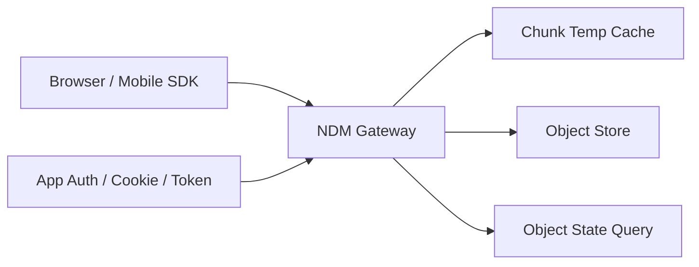
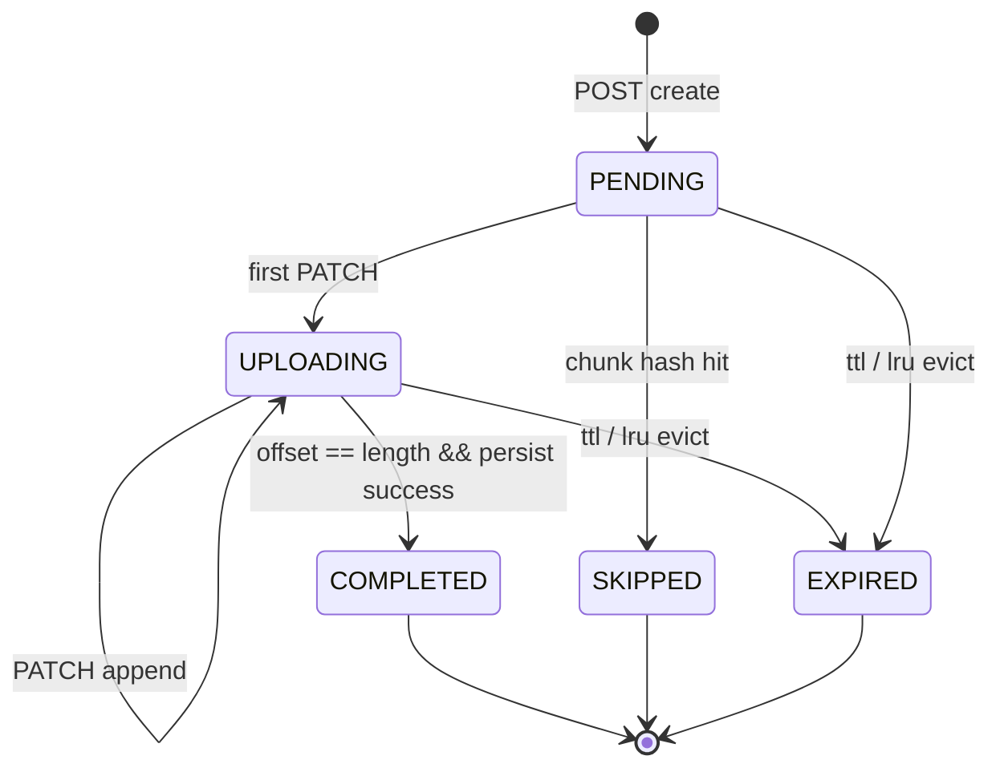
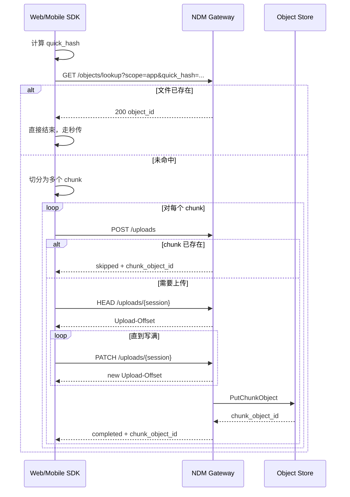

# NDM Gateway 技术需求说明

## 1. 文档目的

本文基于现有口述设计整理 NDM Gateway 的技术需求，作为 Agent / 开发实现的直接输入。重点描述 **upload 协议** 的目标、边界、接口、状态机、缓存模型、并发语义和落地建议；下载与基于 CYFS 的拉取流程仅做必要说明。

本文的核心目标不是抽象出一个“通用文件服务器”，而是定义一套适合 **浏览器 / Mobile SDK + Gateway + 对象存储** 的上传协议，使其同时满足以下诉求：

- 接口语义尽量兼容“`POST` 创建 / `HEAD` 查状态 / `PATCH` 追加数据”的现有风格；
- 上传前可做 **秒传 / 去重短路**；
- 真正的断点续传粒度只落在 **chunk** 层；
- Gateway 负责 **上传状态管理与暂存缓存**；
- 对象存储保持原子写，不承担浏览器侧断点续传；
- 协议对 App 透明，支持未来多个 App 共用同一个公共 Gateway。

---

## 2. 适用范围

### 2.1 本期纳入范围

1. 上传前的对象存在性检查（quick hash 查重）；
2. 基于 chunk 的上传创建、续传、完成与持久化；
3. UploadID / 逻辑路径 / chunk 标识的约束；
4. Gateway 侧缓存、配额、清理与状态管理；
5. 并发上传同一 chunk 时的互斥与幂等；
6. App namespace 与全局 namespace 下的对象查找边界。

### 2.2 本期不强制定义

1. 最终“文件对象 / 清单对象”的装配格式；
2. 上传完成后如何将 chunk 组装成最终业务对象的上层协议；
3. 下载 access code / rawcode 的最终命名、持久化模型与发布系统联动细节；
4. quick hash 的具体算法（仅定义抽象字段，不在网关硬编码算法）。

---

## 3. 设计原则

### 3.1 兼容现有接口风格

上传会话遵循如下语义：

- `POST`：创建 chunk 上传会话；
- `HEAD`：查询当前 chunk 上传状态；
- `PATCH`：向指定 chunk 追加数据。

### 3.2 让前端显式参与 chunk 管理

文件切块语义 **不隐藏在 Gateway 内部**。SDK 必须在客户端完成切块，并以 chunk 为最小上传单元。这样可以：

- 让浏览器 / Mobile SDK 自主控制串行或并行策略；
- 让秒传、局部去重、断点续传更靠前发生；
- 降低 Gateway 的文件级复杂度。

### 3.3 断点续传只做到 chunk 级

对象存储不承担字节级续传。网关负责在本地缓存未完成的 chunk，并维护 offset 状态；一旦 chunk 完整写入对象存储，Gateway 即可删除本地暂存。

### 3.4 逻辑路径既是业务标识，也是缓存命名空间

逻辑路径不是简单文件名，而是 App 能理解、对协议有意义的内部路径。它至少承担两类职责：

1. 未来可作为下载 / 权限判断的业务依据；
2. 在 Gateway 内作为上传状态和缓存的命名空间。

### 3.5 App 优先，兼顾全局共享

上传一定发生在已登录的 App 上下文中，因此上传接口默认以 **App namespace** 为边界。与此同时，系统仍需提供“全局 / 已发布对象”的存在性检查能力，用于更广义的对象复用。

---

## 4. 关键术语

### 4.1 ObjectID

对象在对象存储或对象系统中的稳定标识。若客户端在上传前已经知道目标 ObjectID，可直接将其作为 UploadID 的首选候选。

### 4.2 UploadID

上传资源标识。为了兼容不同来源，UploadID 允许两类来源：

1. **对象 ID 型**：直接使用 `object_id`；
2. **友好路径型**：使用 `app_id + logical_path` 组成稳定业务路径。

> 规范要求：UploadID 必须在一次上传会话中稳定、唯一，并且不能直接依赖本地临时文件路径。

### 4.3 Logical Path

App 侧定义的语义路径。Gateway 不解释其业务含义，但要求其可用于：

- 标识上传上下文；
- 做缓存隔离；
- 为后续下载授权留下可复用的路径信息。

### 4.4 Quick Hash (QCID)

用于上传前短路查重的快速哈希值。它不要求等同于最终全文件强哈希，但必须由 SDK 与服务端使用统一算法。

### 4.5 Chunk

上传最小处理单元。**单个 chunk 最大大小为 32 MiB**。文件超过 32 MiB 时，必须由 SDK 切为多个 chunk 分别上传。

### 4.6 ChunkID / Chunk Index

chunk 的唯一标识或顺序编号。至少要求在一个文件上传上下文中唯一。实现上建议同时保留：

- `chunk_index`：0-based 顺序编号；
- `chunk_hash`：可选但推荐的内容哈希，用于 chunk 级短路复用。

### 4.7 App Namespace

在某个 App 认证上下文内可见的对象视图。该视图通常大于“全局已发布对象视图”。

### 4.8 Global Namespace

系统全局可共享 / 已发布对象的视图。用于公共对象复用，但不保证覆盖某个 App 的全部私有对象。

---

## 5. 总体架构



### 5.1 组件职责

#### SDK 负责

- 计算 quick hash；
- 调用对象存在性查询接口；
- 切 chunk；
- 选择串行或并行上传策略；
- 管理 chunk 级重试；
- 在 chunk 完成后把结果上报给上层业务。

#### Gateway 负责

- 鉴权与 namespace 校验；
- 创建 / 恢复 chunk 上传会话；
- 维护 chunk offset 和缓存文件；
- 完成 chunk 后写入对象存储；
- 完成后清理本地缓存；
- 处理配额、淘汰、超时、并发互斥。

#### 对象存储负责

- 原子写入对象；
- 返回对象标识；
- 不负责浏览器断点续传。

---

## 6. 上传协议：核心需求

### 6.1 上传前快速查重

上传前必须存在一个 **不消耗上传流量** 的对象存在性检查流程。该流程不属于严格意义上的上传协议，但属于网关必须提供的前置能力。

#### 6.1.1 目标

给定文件 quick hash，判断：

1. 当前 App namespace 下是否已存在该对象；
2. 全局可共享对象中是否已存在该对象。

#### 6.1.2 设计要求

- SDK 在本地先计算 `quick_hash`；
- 若命中对象，则直接返回对象信息，跳过上传；
- 若未命中，再进入 chunk 上传流程；
- App namespace 查询与 Global namespace 查询必须是 **两个不同意图** 的接口；
- 两类接口的鉴权和返回范围可以不同。

#### 6.1.3 推荐接口

#### App 视图查询

`GET /ndm/v1/objects/lookup?scope=app&quick_hash={value}`

#### 全局视图查询

`GET /ndm/v1/objects/lookup?scope=global&quick_hash={value}`

#### 6.1.4 返回语义

- `200`：命中，返回 `object_id` 与基础元数据；
- `404`：未命中；
- `401/403`：无权限；
- `400`：算法或参数非法。

---

### 6.2 UploadID 与逻辑路径约束

#### 6.2.1 规范要求

上传资源标识必须支持以下两种来源：

1. **ObjectID 模式**：当目标对象已知时，直接使用 `object_id`；
2. **友好路径模式**：当目标对象未知时，使用 `app_id + logical_path`。

#### 6.2.2 规范化规则

为了便于 Agent 实现，建议网关内部统一生成规范化资源标识：

- `oid:{object_id}`
- `path:{app_id}/{normalized_logical_path}`

#### 6.2.3 逻辑路径约束

逻辑路径至少满足：

- 在 App 内部稳定；
- 对一次上传会话具有唯一性；
- 不允许 `..` 等目录穿越；
- 不允许依赖客户端本地绝对路径；
- 应可被安全地映射到 Gateway 本地缓存目录；
- 推荐只使用 URL-safe 字符集；
- 服务端至少应接受常见文件名字符（如空格、括号），但仍需拒绝控制字符、反斜杠和目录穿越模式。

#### 6.2.4 关于“逻辑路径是否需要包含 chunk 编号”

口述设计中存在“逻辑路径与 chunk 粒度绑定”的倾向。为降低实现歧义，本文做如下约定：

- **外部协议**：客户端必须显式传 `logical_path` 与 `chunk_index`；
- **内部实现**：Gateway 可以将 `chunk_index` 编码进最终缓存 key；
- **更保守的 SDK 实践**：若客户端需要强行映射到“每个逻辑路径只对应一个 32 MiB 暂存区”的模型，可以自行把 `chunk_index` 或并发 lane 编入 `logical_path`。

换言之，`logical_path` 是否编码 chunk 信息，允许由 SDK 决定；但 Gateway 的唯一键必须至少包含：

- `app_id`
- `logical_path`
- `file_hash`（或 file identity）
- `chunk_index`

---

### 6.3 Chunk 模型

#### 6.3.1 切块要求

- 单 chunk 最大 32 MiB；
- 文件超过 32 MiB 时必须切块；
- chunk 可以串行上传，也可以并行上传；
- Gateway 协议本身 **不限制** SDK 采用串行还是并行。

#### 6.3.2 chunk 级断点续传

断点续传仅在 chunk 内部生效：

- 未完成的 chunk 在 Gateway 本地保留 offset 和缓存文件；
- 已完成的 chunk 立即写入对象存储；
- 写入成功后，本地缓存应尽快删除；
- 若缓存被淘汰，则当前 chunk 只能从 0 重新上传。

#### 6.3.3 chunk 级复用

即使全文件 quick hash 未命中，上传过程中仍允许发生 **chunk 级复用**：

- 若某个 chunk 的内容哈希已在系统中存在，则该 chunk 可直接跳过上传；
- 这能让长文件在中途出现“后续 chunk 突然秒传”的效果。

---

### 6.4 接口规范（推荐稿）

> 说明：以下为供 Agent 落地的推荐 HTTP 契约。字段名可在代码阶段微调，但语义不应变化。

#### 6.4.1 创建 chunk 上传会话

`POST /ndm/v1/uploads`

#### 请求头

- `Authorization` / Cookie：认证信息，必须
- `Upload-Length`：当前 chunk 总长度，必须
- `Upload-Metadata`：元数据，必须，建议包含：
  - `app_id`
  - `logical_path`
  - `file_name`
  - `file_size`
  - `file_hash`（强哈希，若有）
  - `quick_hash`（若有）
  - `chunk_index`
  - `chunk_hash`（推荐）
  - `mime_type`
- `NDM-Upload-ID`：可选。若客户端不传，由网关根据 `object_id` 或 `app_id + logical_path` 生成。

#### 请求体

空。

#### 成功响应

- `201 Created`
- `Location: /ndm/v1/uploads/{session_id}`
- `NDM-Upload-ID: {canonical_upload_id}`
- `Upload-Offset: 0`
- `Upload-Length: {chunk_size}`
- `NDM-Chunk-Status: pending | uploading | completed | skipped`
- `Upload-Expires: {rfc3339}`（可选）

#### 特殊响应

- 若 chunk 已存在：
  - `200 OK` 或 `204 No Content`
  - `NDM-Chunk-Status: skipped`
  - `NDM-Chunk-Object-ID: {object_id}`
- 若相同会话已存在：
  - 返回已有会话与当前 offset，避免重复创建
- 若同一路径存在旧会话但 `file_hash` 已变化：
  - 网关应先清理旧缓存，再创建新会话

#### 6.4.2 查询 chunk 上传状态

`HEAD /ndm/v1/uploads/{session_id}`

#### 响应头

- `Upload-Offset`
- `Upload-Length`
- `NDM-Chunk-Status`
- `NDM-Upload-ID`
- `NDM-Chunk-Object-ID`（已完成时可返回）
- `Upload-Expires`（若存在）

#### 语义

- 用于断点续传时获取已接收 offset；
- 用于客户端确认 chunk 是否已被其他并发方完成；
- 不返回响应体。

#### 6.4.3 追加 chunk 数据

`PATCH /ndm/v1/uploads/{session_id}`

#### 请求头

- `Content-Type: application/offset+octet-stream`
- `Upload-Offset: {client_known_offset}`，必须
- `Content-Length: {body_len}`，必须
- `Upload-Checksum: {algo digest}`，可选但推荐

#### 请求体

原始二进制数据。

#### 成功响应

- `204 No Content`
- `Upload-Offset: {new_offset}`
- `NDM-Chunk-Status: uploading | completed`
- 若刚好写满并持久化成功：
  - `NDM-Chunk-Status: completed`
  - `NDM-Chunk-Object-ID: {object_id}`

#### 失败响应

- `409 Conflict` / `412 Precondition Failed`：offset 不匹配
- `410 Gone`：会话已过期或缓存已被淘汰
- `413 Payload Too Large`：超出 chunk 大小限制
- `423 Locked`：该 chunk 当前被其他活跃会话占用
- `507 Insufficient Storage`：App 缓存配额不足且无法继续分配

---

### 6.5 状态机



#### 6.5.1 状态定义

- `pending`：会话已创建，尚未收到数据；
- `uploading`：已接收部分数据，offset > 0 且未完成；
- `completed`：chunk 已写入对象存储；
- `skipped`：chunk 已通过去重命中，无需上传；
- `expired`：未完成 chunk 的缓存已过期或被淘汰。

---

### 6.6 并发与幂等要求

#### 6.6.1 同一 chunk 只允许一个活跃写入者

系统必须保证：**同一个 chunk 在同一时刻最多只有一个活跃写入流程**。

#### 6.6.2 并发创建语义

如果两个客户端同时上传同一 chunk：

1. 只有一个 `POST` 能成功创建或占有会话；
2. 其他调用方应获得“已存在”结果，并转为：
   - 查询状态；或
   - 等待对方完成；或
   - 直接使用已完成结果。

#### 6.6.3 幂等要求

对相同 `(app_id, logical_path, file_hash, chunk_index)` 的重复 `POST`，网关应尽量做到幂等：

- 若会话存在且上下文一致，返回已有会话；
- 若 chunk 已完成，返回 `completed / skipped` 状态；
- 若同一路径对应的 `file_hash` 已变化，应视为新文件，清理旧未完成状态。

---

### 6.7 Gateway 侧缓存与状态管理

#### 6.7.1 基本模型

Gateway 主要维护的是 **未完成 chunk 的缓存状态**，而不是最终对象状态。

每个未完成的 chunk 至少需要保存：

- `session_id`
- `canonical_upload_id`
- `app_id`
- `logical_path`
- `file_hash`
- `chunk_index`
- `chunk_size`
- `received_offset`
- `temp_file_path`
- `created_at`
- `updated_at`
- `lease_owner / lock_version`（推荐）

#### 6.7.2 存储位置

- 缓存位于 Gateway 节点本地；
- 不要求全内存；
- 推荐：元数据放内存 / 本地 KV，二进制暂存放磁盘文件。

#### 6.7.3 淘汰策略

缓存必须支持：

- `TTL` 过期；
- 基于 `LRU` 的容量淘汰；
- 按 App 配额统计与淘汰。

#### 6.7.4 配额要求

- 配额按 App 维度计算；
- App 可共用系统级 Gateway，但各自承担自己的缓存空间消耗；
- 当 App 超过缓存配额时，优先淘汰最老、最久未访问、未完成的 chunk 缓存。

#### 6.7.5 淘汰的业务后果

淘汰缓存 **不会造成最终对象损坏**，只会导致：

- 当前 chunk 的断点续传失效；
- SDK 需要从该 chunk 的 0 offset 重新上传；
- 最坏情况下，用户多重传一次 `<32 MiB` 的数据。

这也是该方案可接受的重要前提。

---

### 6.8 持久化时机

#### 6.8.1 chunk 完成即持久化

一旦 `received_offset == chunk_size`：

1. Gateway 校验 chunk 完整性；
2. 立即写入对象存储；
3. 获取 `chunk_object_id`；
4. 更新状态为 `completed`；
5. 删除本地缓存文件；
6. 返回对象标识给客户端。

#### 6.8.2 不在 Gateway 长时间保留已完成 chunk 缓存

已完成 chunk 的本地缓存没有保留必要，应尽快回收，以减少网关磁盘压力。

---

### 6.9 完整上传时序



---

### 6.10 SDK 行为要求

#### 6.10.1 必须支持的行为

- 本地计算 quick hash；
- 文件切块；
- 每个 chunk 独立上传；
- 基于 `HEAD` 的断点恢复；
- 处理 `409/410/423/507` 等响应；
- 能在 chunk 被淘汰后自动从头上传当前 chunk。

#### 6.10.2 推荐支持的行为

- 计算 `chunk_hash`，实现 chunk 级短路复用；
- 支持有限并发；
- 上报上传进度与失败原因；
- 上传完成后组装 chunk object 列表，交给上层业务生成最终文件对象。

#### 6.10.3 SDK 并发策略建议

- 默认 1~4 个并发 chunk 即可；
- 不建议无限并发；
- 若一个 App 需要多个并发上传槽位，建议让 `logical_path` 或其派生键中包含 lane 信息。

---

### 6.11 安全与权限要求

#### 6.11.1 上传必须在 App 登录态下发生

上传默认要求 App 侧已登录，且 Gateway 必须能识别调用方所属的 App 上下文。

#### 6.11.2 对象存在性查询的安全边界

- `scope=app`：仅返回当前 App 可见对象；
- `scope=global`：仅返回全局可共享 / 已发布对象；
- 两种查询不能混淆。

#### 6.11.3 逻辑路径的权限意义

逻辑路径未来可能被用于：

- 下载授权；
- path-based access code；
- 路由到某个业务目录或发布入口。

因此 Gateway 不应把逻辑路径仅仅当作“临时缓存文件名”。

---

### 6.12 错误码建议

| HTTP 状态码 | 场景 | 处理建议 |
|---|---|---|
| 200 | 查重命中 / 会话已存在 | 读取返回状态后决定是否跳过 |
| 201 | 会话创建成功 | 开始上传 |
| 204 | PATCH 成功或无需返回 body | 继续上传 / 结束 |
| 400 | 参数不合法 | SDK 修正参数 |
| 401 | 未认证 | 重新登录 |
| 403 | 无权限 | 终止上传 |
| 404 | 查询未命中 / 会话不存在 | 重新创建会话 |
| 409 | offset 冲突 / 并发冲突 | HEAD 重新拉取状态 |
| 410 | 会话过期 / 缓存已淘汰 | 从该 chunk 头部重传 |
| 412 | 预条件失败 | HEAD 校准 offset |
| 413 | chunk 超过 32 MiB | SDK 重新切块 |
| 423 | chunk 被其他会话锁定 | 稍后重试或改走查询 |
| 429 | 请求过快 | 指数退避 |
| 507 | 缓存配额不足 | 等待或减少并发 |

---

## 7. 面向 Agent 的实现分解

### 7.1 模块拆分

建议 Agent 将 NDM Gateway 至少拆为以下模块：

1. `auth_guard`
   - 解析登录态、App 身份、namespace；
2. `object_lookup_service`
   - quick hash 查询；
3. `upload_session_service`
   - 创建 / 恢复 / 查询 chunk 会话；
4. `temp_cache_manager`
   - 分配缓存文件、维护 offset、淘汰；
5. `chunk_write_service`
   - 校验 offset、追加写入、落盘；
6. `chunk_dedupe_service`
   - chunk hash 命中与跳过逻辑；
7. `object_store_adapter`
   - chunk 完成后的原子持久化；
8. `gc_scheduler`
   - TTL / LRU / 配额清理；
9. `metrics_audit`
   - 指标、日志、审计。

### 7.2 推荐内部数据模型

### upload_sessions

- `session_id`
- `canonical_upload_id`
- `app_id`
- `logical_path`
- `file_hash`
- `chunk_index`
- `chunk_hash`
- `chunk_size`
- `offset`
- `status`
- `temp_file_path`
- `expires_at`
- `created_at`
- `updated_at`

### app_cache_usage

- `app_id`
- `bytes_in_use`
- `quota_bytes`
- `last_eviction_at`

### chunk_objects

- `chunk_hash`
- `chunk_object_id`
- `size`
- `created_at`

### 7.3 核心流程伪代码

```text
create_session(req):
  auth = check_auth(req)
  meta = parse_upload_metadata(req)
  validate_chunk_size(meta.chunk_size <= 32MiB)
  canonical_upload_id = normalize(meta.object_id or meta.app_id + meta.logical_path)

  if meta.file_hash changed under same (app_id, logical_path):
      invalidate_old_incomplete_sessions(app_id, logical_path)

  if meta.chunk_hash exists and chunk_object already exists:
      return skipped(chunk_object_id)

  existing = find_existing_session(app_id, logical_path, file_hash, chunk_index)
  if existing:
      return existing

  ensure_app_quota(meta.chunk_size)
  session = allocate_temp_cache_and_create_session(...)
  return session

append_chunk(session_id, offset, bytes):
  session = load_session(session_id)
  check_not_expired(session)
  check_offset_match(session.offset, offset)
  append_to_temp_file(session.temp_file_path, bytes)
  session.offset += len(bytes)

  if session.offset == session.chunk_size:
      verify_checksum_if_needed(session)
      object_id = persist_chunk_to_object_store(session.temp_file_path)
      mark_completed(session, object_id)
      delete_temp_file(session.temp_file_path)
      return completed(object_id)

  save_session(session)
  return uploading(session.offset)
```

---

## 8. 验收标准

### 8.1 功能验收

系统至少要通过以下场景：

1. **全文件秒传**
   - quick hash 命中后，不发生任何 chunk 上传。
2. **单 chunk 正常上传**
   - 创建、PATCH、完成、持久化、清缓存全链路成功。
3. **多 chunk 串行上传**
   - 所有 chunk 可依次完成。
4. **多 chunk 并行上传**
   - 互不影响，最终各自完成。
5. **chunk 中断恢复**
   - HEAD 返回 offset，PATCH 从断点继续。
6. **chunk 缓存淘汰后恢复**
   - 返回 `410`，SDK 自动从该 chunk 头部重传。
7. **chunk 级复用**
   - 中途发现某 chunk 已存在，允许跳过上传。
8. **并发上传同一 chunk**
   - 只有一个写入者成功占有，其他方不会写乱数据。
9. **相同逻辑路径文件变更**
   - 能识别 `file_hash` 变化并清理旧缓存。
10. **App 配额触发**
    - 能执行 LRU 淘汰，并保持服务可用。

### 8.2 非功能验收

- 不允许 chunk 数据错位写入；
- 不允许不同 App 相互污染缓存命名空间；
- 已完成 chunk 不应长期占用 Gateway 本地磁盘；
- 任何缓存淘汰都只能影响续传体验，不能破坏已落盘对象；
- 关键路径必须可观测：
  - 创建会话次数
  - 秒传命中率
  - chunk 复用命中率
  - 续传命中率
  - 缓存淘汰次数
  - 对象存储写入成功率

---

## 9. 下载 / CYFS 相关说明（简述）

虽然本文重点在上传，但 Gateway 还需承担基于标准 CYFS 协议的数据拉取能力。当前可先维持以下原则：

1. 给定 `object_id` 时，可直接从对象存储打开流并映射到 HTTP；
2. 若系统配置要求 object_id 受保护，则默认仅可信设备可直接访问；
3. 若对象位于公开列表，则可放开访问；
4. 对外分享时，可通过 `app_id + path` 派生的访问码（rawcode / access code，命名待统一）进行控制；
5. 该访问控制状态更偏持久化，不属于上传缓存状态；
6. 上传缓存状态与下载授权状态必须分层设计，不可混为一类状态。

---

使用 impl HttpServer for NamedStoreMgrZoneGateway 的方式实现
